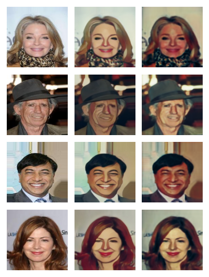

# CS236 Project: Distilling GANs for Mobile and Embedded Devices
This repository contains code for my CS 236 project on compressing GANs using knowledge distillation. This project attempts to compress the very popular [Anime GAN V2](https://github.com/bryandlee/animegan2-pytorch) network with weights for 3 different anime styles. Bulk of the data is generated using [CelebA](https://mmlab.ie.cuhk.edu.hk/projects/CelebA.html) and [Flickr Faces](https://github.com/NVlabs/ffhq-dataset) datasets. For a full explanation of the approach used in this repository, please see the included PDF report above.

## Getting Started
1. Download the dataset from [this link](https://dsagardldata.s3.us-west-2.amazonaws.com/faces.zip).
2. As a default, unzip the dataset under a ```../data/``` folder relative to the root of this repository (although this can be configured as a parameter to ```main.py```).
3. Install project requirements by running ```pip install -r requirements.txt```. Use of a virtualenv is highly recommended.
4. Run ```python main.py``` to begin training. Note that this file has a lot of optional command line arguments which can be inspected by running ```python main.py --help```.
5. Alternatively, you may run through the ```AnimeDistillation.ipynb``` notebook for a more interactive experience.

## Running FID comparison
1. In order to build datasets for running FID comparison, please see the ```Samples.ipynb``` notebook.
2. If you haven't, install pytorch fid by running ```pip install pytorch-fid```
3. "Ground-Truth" data can be generated by using pretrained models at [animegan2-pytorch](https://github.com/bryandlee/animegan2-pytorch). The ```test.py``` file at this repo takes command line parameters for trained models as well as input and output folders.
4. See [pytorch-fid](https://github.com/mseitzer/pytorch-fid) repo for how to compare FID scores.

Please find a comparison between input image, Anime GAN V2 generated output and compressed student network output below:\


## Acknowledgements
This work makes use of the following open-source tools and repositories:
1. [PyTorch Anime GAN V2](https://github.com/bryandlee/animegan2-pytorch) implementation
2. Mobile optimized-network backbones from [snapml-templates](https://github.com/Snapchat/snapml-templates)
3. PyTorch implementation of [FID Scores](https://github.com/mseitzer/pytorch-fid)
4. Some mobile layers are included from [FastDepth](https://github.com/dwofk/fast-depth) repo
5. Implementation of [LPIPS](https://github.com/richzhang/PerceptualSimilarity)